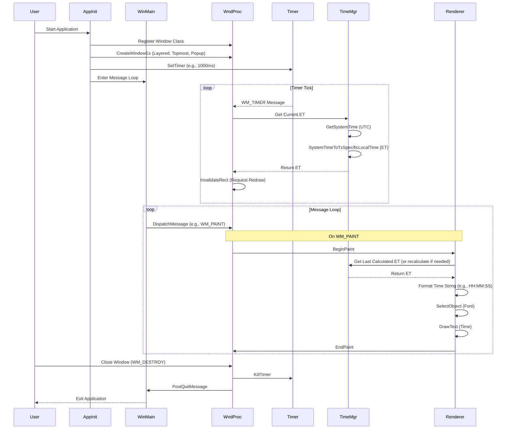

# Path: Architecture and System Design for EST Overlay Clock

## 1. Introduction

This document outlines the high-level architecture and system design for a Windows application that displays a transparent overlay clock showing the current Eastern Time Zone (ET), regardless of the user's system time zone settings. The application leverages native Windows API functions for efficiency and minimal resource usage.

**Goals:**

*   Display the current Eastern Time (ET), including handling Daylight Saving Time (DST).
*   Present the clock in a transparent, borderless window.
*   Ensure the clock window remains on top of other applications.
*   Update the displayed time periodically (e.g., every second).
*   Utilize only standard Windows API functions.

## 2. High-Level Architecture

The application consists of several interacting components responsible for specific tasks:

*   **Window Manager:** Handles the creation, styling (transparency, topmost), positioning, and lifecycle of the application window.
*   **Time Manager:** Responsible for fetching the current Coordinated Universal Time (UTC) and converting it to Eastern Time (ET), correctly accounting for DST.
*   **Rendering Engine:** Draws the formatted time string onto the window surface.
*   **Update Mechanism:** Uses a system timer to trigger periodic updates of the time display.
*   **Main Application Logic:** Contains the main message loop (`WinMain`) and the window procedure (`WndProc`) to handle system messages and coordinate component interactions.

### Component Interaction Flow

The following diagram illustrates the typical interaction flow between the components:

## 3. System Design Details

### 3.1. Window Manager

*   **Creation:** Uses `CreateWindowEx` with the following crucial styles:
    *   `WS_EX_LAYERED`: Enables transparency effects.
    *   `WS_EX_TOPMOST`: Keeps the window above all non-topmost windows.
    *   `WS_POPUP`: Creates a borderless window suitable for an overlay.
*   **Transparency:** Managed by `SetLayeredWindowAttributes`. This can set overall alpha blending (opacity) and/or a specific color key to be fully transparent. For a simple text overlay, setting a color key (e.g., black background) and drawing contrasting text is often effective.
*   **Positioning & Sizing:** Initially set during `CreateWindowEx`. Can be dynamically changed using `SetWindowPos`. `HWND_TOPMOST` flag in `SetWindowPos` reinforces the topmost status.
*   **Lifecycle:** Standard window message handling (`WM_CREATE`, `WM_DESTROY`, etc.) within the `WndProc`.

### 3.2. Time Manager

*   **UTC Acquisition:** Uses `GetSystemTime` to retrieve the current time in UTC. This provides a reliable, timezone-independent base time.
*   **ET Conversion:** Uses `SystemTimeToTzSpecificLocalTime`. Requires a `TIME_ZONE_INFORMATION` structure populated with the correct parameters for the "Eastern Standard Time" zone (Windows registry name). This function automatically handles standard/daylight time transitions based on the rules defined for the specified time zone.
*   **Data Structure:** `SYSTEMTIME` structure is used to hold both UTC and the resulting ET time components (year, month, day, hour, minute, second, millisecond).

### 3.3. Rendering Engine

*   **Trigger:** Primarily driven by the `WM_PAINT` message.
*   **Drawing Context:** `BeginPaint` obtains the device context (HDC) required for drawing operations. `EndPaint` releases it.
*   **Text Formatting:** The ET `SYSTEMTIME` structure is formatted into a display string (e.g., "HH:MM:SS") using functions like `wsprintf`.
*   **Text Rendering:** `DrawText` is used to render the formatted time string onto the window's device context. It allows specifying the bounding rectangle and text alignment (e.g., `DT_CENTER`, `DT_VCENTER`).
*   **Appearance:** `CreateFont` and `SelectObject` are used to choose the font, size, and style for the displayed time. The background mode might be set to `TRANSPARENT` using `SetBkMode` if not using color keying.
*   **Redrawing:** `InvalidateRect` (often called after a time update) marks the window area as needing a repaint, which subsequently triggers `WM_PAINT`. `RedrawWindow` offers more control but `InvalidateRect` is sufficient for simple periodic updates.

### 3.4. Update Mechanism

*   **Timer Creation:** `SetTimer` is called (typically during `WM_CREATE`) to establish a periodic timer. An interval of 1000ms is suitable for a seconds-updating clock.
*   **Timer Events:** The timer generates `WM_TIMER` messages at the specified interval.
*   **Timer Destruction:** `KillTimer` is called (typically during `WM_DESTROY`) to release the timer resources.

### 3.5. Main Application Logic

*   **`WinMain`:** The application entry point. Registers the window class (`WNDCLASSEX`), creates the main window (`CreateWindowEx`), and enters the message loop (`GetMessage`, `TranslateMessage`, `DispatchMessage`).
*   **`WndProc`:** The window procedure handles messages dispatched from the message loop. Key messages include:
    *   `WM_CREATE`: Initialize application state, create the timer.
    *   `WM_TIMER`: Trigger time fetching, conversion, and invalidation (`InvalidateRect`).
    *   `WM_PAINT`: Handle drawing the clock face using the Rendering Engine functions.
    *   `WM_DESTROY`: Clean up resources (kill timer) and signal application exit (`PostQuitMessage`).

## 4. Core Logic Flow Summary

1.  **Initialization:** Register window class, create a layered, topmost, popup window. Create a 1-second timer.
2.  **Message Loop:** Wait for and dispatch messages.
3.  **On Timer Tick (`WM_TIMER`):**
    *   Get current UTC time (`GetSystemTime`).
    *   Convert UTC to ET (`SystemTimeToTzSpecificLocalTime`).
    *   Store the new ET.
    *   Invalidate the window (`InvalidateRect`) to request a repaint.
4.  **On Paint Request (`WM_PAINT`):**
    *   Begin painting (`BeginPaint`).
    *   Retrieve the stored/latest ET.
    *   Format the ET into a string.
    *   Select the desired font (`SelectObject`).
    *   Draw the time string (`DrawText`).
    *   End painting (`EndPaint`).
5.  **Termination (`WM_DESTROY`):**
    *   Destroy the timer (`KillTimer`).
    *   Post quit message to exit the message loop.

## 5. Conclusion

This design leverages specific Windows API functions to create an efficient, native transparent overlay clock. By separating concerns into distinct managers (Window, Time, Rendering, Update), the architecture remains modular and understandable. The core logic relies on the standard Windows message loop and handling specific messages (`WM_TIMER`, `WM_PAINT`) to drive the clock's functionality.