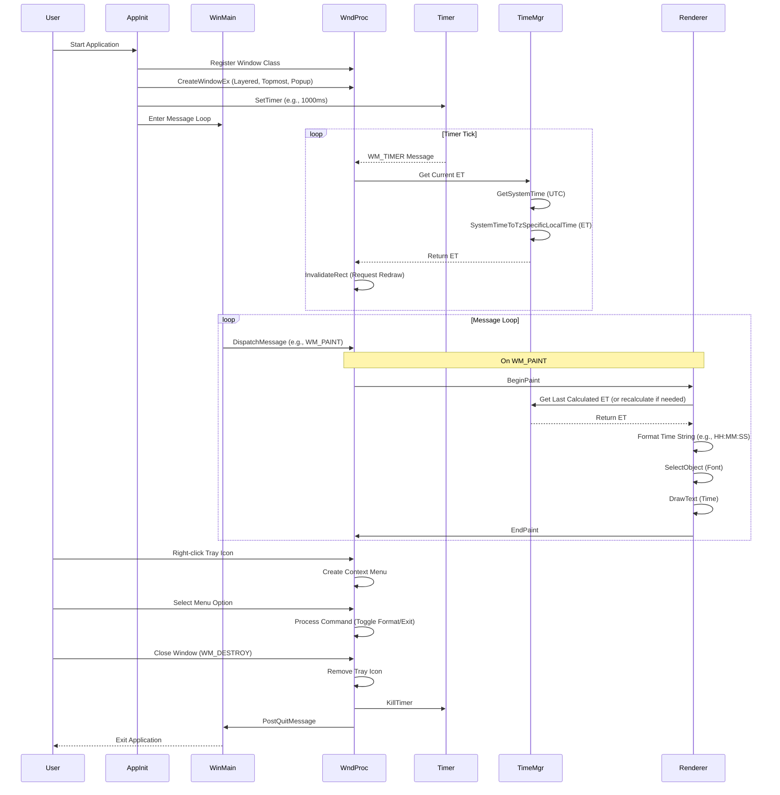

# Path: Architecture and System Design for EST Overlay Clock

## 1. Introduction

This document outlines the high-level architecture and system design for a Windows application that displays a transparent overlay clock showing the current Eastern Time Zone (ET), regardless of the user's system time zone settings. The application leverages native Windows API functions for efficiency and minimal resource usage.

**Goals:**

*   Display the current Eastern Time (ET), including handling Daylight Saving Time (DST).
*   Present the clock in a transparent, borderless window.
*   Ensure the clock window remains on top of other applications.
*   Update the displayed time periodically (every second).
*   Utilize only standard Windows API functions.
*   Provide system tray icon for easy access and control.
*   Support both 12-hour and 24-hour time formats.
*   Allow dragging the window to any desired position.

## 2. High-Level Architecture

The application consists of several interacting components responsible for specific tasks:

*   **Window Manager:** Handles the creation, styling (transparency, topmost), positioning, and lifecycle of the application window.
*   **Time Manager:** Responsible for fetching the current Coordinated Universal Time (UTC) and converting it to Eastern Time (ET), correctly accounting for DST.
*   **Rendering Engine:** Draws the formatted time string onto the window surface.
*   **Update Mechanism:** Uses a system timer to trigger periodic updates of the time display.
*   **System Tray Integration:** Manages the system tray icon and its context menu for controlling the application.
*   **Format Manager:** Handles switching between 12-hour and 24-hour time formats.
*   **Main Application Logic:** Contains the main message loop (`WinMain`) and the window procedure (`WndProc`) to handle system messages and coordinate component interactions.

### Component Interaction Flow

The following diagram illustrates the typical interaction flow between the components:

## 3. System Design Details

### 3.1. Window Manager

*   **Creation:** Uses `CreateWindowEx` with the following crucial styles:
    *   `WS_EX_LAYERED`: Enables transparency effects.
    *   `WS_EX_TOPMOST`: Keeps the window above all non-topmost windows.
    *   `WS_EX_TOOLWINDOW`: Prevents the window from appearing in the taskbar.
    *   `WS_POPUP`: Creates a borderless window suitable for an overlay.
*   **Transparency:** Managed by `SetLayeredWindowAttributes`. Uses alpha blending (opacity) to create a semi-transparent window with a value of 175 (out of 255).
*   **Positioning & Sizing:** Initially positioned at the bottom-right corner of the screen. Window width adjusts automatically based on the selected time format (wider for 12-hour format).
*   **Draggability:** Implements custom `WM_NCHITTEST` handling to allow dragging the window by treating the client area as a caption.
*   **Lifecycle:** Standard window message handling (`WM_CREATE`, `WM_DESTROY`, etc.) within the `WndProc`.

### 3.2. Time Manager

*   **UTC Acquisition:** Uses `GetSystemTime` to retrieve the current time in UTC. This provides a reliable, timezone-independent base time.
*   **ET Conversion:** Uses `SystemTimeToTzSpecificLocalTime`. Requires a `TIME_ZONE_INFORMATION` structure populated with the correct parameters for the "Eastern Standard Time" zone (Windows registry name). This function automatically handles standard/daylight time transitions based on the rules defined for the specified time zone.
*   **Data Structure:** `SYSTEMTIME` structure is used to hold both UTC and the resulting ET time components (year, month, day, hour, minute, second, millisecond).

### 3.3. Rendering Engine

*   **Trigger:** Primarily driven by the `WM_PAINT` message.
*   **Drawing Context:** `BeginPaint` obtains the device context (HDC) required for drawing operations. `EndPaint` releases it.
*   **Text Formatting:** The ET `SYSTEMTIME` structure is formatted into a display string (e.g., "HH:MM:SS") using functions like `wsprintf`.
*   **Text Rendering:** `DrawText` is used to render the formatted time string onto the window's device context. It allows specifying the bounding rectangle and text alignment (e.g., `DT_CENTER`, `DT_VCENTER`).
*   **Appearance:** `CreateFont` and `SelectObject` are used to choose the font (Arial, 32pt, bold), size, and style for the displayed time. The background mode is set to `TRANSPARENT` using `SetBkMode` with white text on a black background.
*   **Format Handling:** Supports both 12-hour (with AM/PM) and 24-hour time formats, with the ability to switch between them via the context menu.
*   **Redrawing:** `InvalidateRect` (often called after a time update or format change) marks the window area as needing a repaint, which subsequently triggers `WM_PAINT`.

### 3.4. Update Mechanism

*   **Timer Creation:** `SetTimer` is called (typically during `WM_CREATE`) to establish a periodic timer. An interval of 1000ms is suitable for a seconds-updating clock.
*   **Timer Events:** The timer generates `WM_TIMER` messages at the specified interval.
*   **Timer Destruction:** `KillTimer` is called (typically during `WM_DESTROY`) to release the timer resources.

### 3.5. System Tray Integration

*   **Initialization:** Creates and adds a system tray icon during `WM_CREATE` using `Shell_NotifyIcon` with the `NIM_ADD` command.
*   **Icon Interaction:** Handles left-click (show/hide window) and right-click (display context menu) events via the `WM_TRAYICON` custom message.
*   **Context Menu:** Creates a popup menu with options to toggle between time formats and exit the application.
*   **Cleanup:** Removes the tray icon during `WM_DESTROY` using `Shell_NotifyIcon` with the `NIM_DELETE` command.

### 3.6. Format Manager

*   **Toggle Mechanism:** Switches between 12-hour and 24-hour formats via the `IDM_TOGGLE_FORMAT` command.
*   **Window Adjustment:** Automatically resizes and repositions the window when changing formats to accommodate the different text lengths.
*   **Format Application:** Applies the selected format during the `WM_PAINT` handler, using different `StringCchPrintf` formatting based on the `g_use12HourFormat` flag.

### 3.7. Main Application Logic

*   **`WinMain`:** The application entry point. Registers the window class (`WNDCLASSEX`), creates the main window (`CreateWindowEx`), and enters the message loop (`GetMessage`, `TranslateMessage`, `DispatchMessage`).
*   **`WndProc`:** The window procedure handles messages dispatched from the message loop. Key messages include:
    *   `WM_CREATE`: Initialize application state, create the timer and system tray icon.
    *   `WM_TIMER`: Trigger time fetching, conversion, and invalidation (`InvalidateRect`).
    *   `WM_PAINT`: Handle drawing the clock face using the Rendering Engine functions.
    *   `WM_TRAYICON`: Process system tray icon interactions.
    *   `WM_CONTEXTMENU`: Display the context menu when right-clicking the window.
    *   `WM_COMMAND`: Process menu commands (toggle format, exit).
    *   `WM_NCHITTEST`: Enable window dragging.
    *   `WM_DESTROY`: Clean up resources (remove tray icon, kill timer) and signal application exit (`PostQuitMessage`).

## 4. Core Logic Flow Summary

1.  **Initialization:**
    *   Register window class, create a layered, topmost, popup window.
    *   Create and select a bold font for the time display.
    *   Create a 1-second timer.
    *   Initialize and add the system tray icon.
    *   Perform initial time update.

2.  **Message Loop:** Wait for and dispatch messages.

3.  **On Timer Tick (`WM_TIMER`):**
    *   Get current UTC time (`GetSystemTime`).
    *   Convert UTC to ET (`SystemTimeToTzSpecificLocalTime`).
    *   Store the new ET.
    *   Invalidate the window (`InvalidateRect`) to request a repaint.

4.  **On Paint Request (`WM_PAINT`):**
    *   Begin painting (`BeginPaint`).
    *   Fill the background with black.
    *   Set up transparent background mode and white text color.
    *   Select the bold font.
    *   Format the ET into a string based on the selected format (12-hour or 24-hour).
    *   Draw the time string centered in the window (`DrawText`).
    *   End painting (`EndPaint`).

5.  **On Tray Icon Interaction (`WM_TRAYICON`):**
    *   Left-click: Toggle window visibility (show/hide).
    *   Right-click: Display context menu with format toggle and exit options.

6.  **On Menu Command (`WM_COMMAND`):**
    *   Toggle Format: Switch between 12-hour and 24-hour formats, adjust window size.
    *   Exit: Destroy the window, triggering application termination.

7.  **Termination (`WM_DESTROY`):**
    *   Remove the system tray icon.
    *   Destroy the timer (`KillTimer`).
    *   Delete the font object.
    *   Post quit message to exit the message loop.

## 5. Conclusion

This design leverages specific Windows API functions to create an efficient, native transparent overlay clock. By separating concerns into distinct managers (Window, Time, Rendering, Update, System Tray, Format), the architecture remains modular and understandable. The core logic relies on the standard Windows message loop and handling specific messages (`WM_TIMER`, `WM_PAINT`, `WM_TRAYICON`, etc.) to drive the clock's functionality.

The implementation successfully achieves all the stated goals, providing a lightweight, transparent overlay clock that displays Eastern Time with both 12-hour and 24-hour format options, system tray integration for easy control, and the ability to reposition the clock anywhere on the screen.